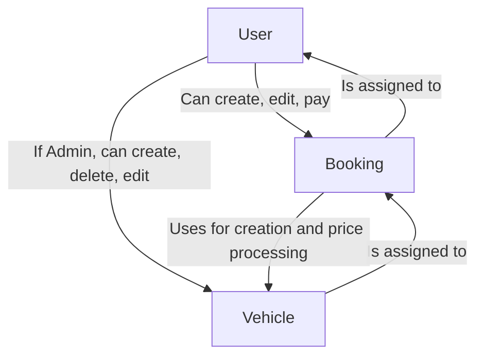

```mermaid
    graph TD
    User -->|Can create, edit, pay| Booking
    User -->|If Admin, can create, delete, edit| Vehicle
    Booking -->|Is assigned to| User
    Vehicle -->|Is assigned to| Booking
    Booking -->|Uses for creation and price processing| Vehicle

    %% User : mail, password, firstName, lastName, licenseDate, roles, bookings (relation)
    %% Vehicle : model, brand, pricePerDay, bookings (relation)
    %% Booking : startDate, endDate, status, vehicle (relation), hasInsurance, customer (relation), paymentMethod, totalPrice, paymentDate

```
