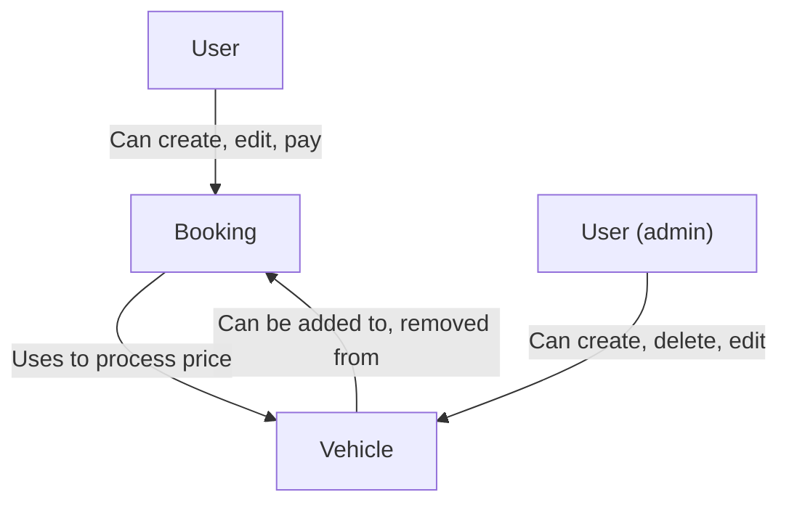

```mermaid
    graph TD
    User -->|Can create, edit, pay| Booking
    Vehicle -->|Can be added to, removed from| Booking
    Booking -->|Uses to process price| Vehicle
    Admin["User (admin)"] -->|Can create, delete, edit| Vehicle


    %% User : mail, password, firstName, lastName, licenseDate, roles, bookings (relation)
    %% Vehicle : model, brand, pricePerDay, bookings (relation)
    %% Booking : startDate, endDate, status, vehicle (relation), hasInsurance, customer (relation), paymentMethod, totalPrice, paymentDate

```
